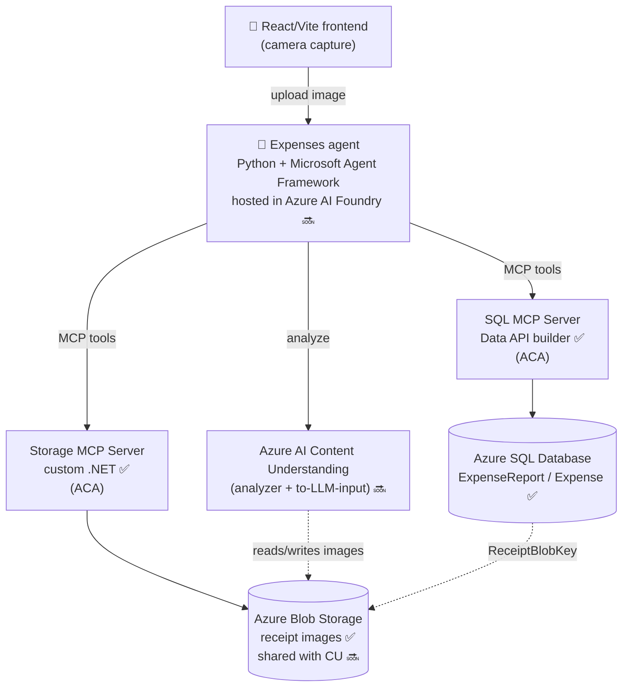

# Architecture — Expenses Agent PoC

An agent-driven expense-reporting proof of concept. A user photographs a receipt,
the image is stored in Azure Blob Storage, an agent uses **Azure AI Content
Understanding** to extract the expense data, and the structured result is persisted
in **Azure SQL** — with the receipt image referenced (not embedded) from SQL.

Two capabilities are exposed to the agent as **Model Context Protocol (MCP)
servers**:

- a **SQL MCP Server** (Data API builder) for structured expense records, and
- a **Storage MCP Server** (custom) for the receipt images.

> **Status legend:** ✅ implemented today · 🔜 planned / target state.

---

## 1. High-level architecture (target)



**Core idea:** Content Understanding and the app share **one** blob container, so
every analyzed image is the exact blob referenced by `ReceiptBlobKey` in SQL — a
single source of truth for receipts.

---

## 2. Components

| Component | Path | Tech | Status |
| --- | --- | --- | --- |
| Aspire AppHost | `src/aspire/apphost.cs` | Aspire (file-based) | ✅ |
| SQL project (schema + DAB config) | `src/expenses-database/` | `schema.sql`, `dab-config.json` | ✅ |
| SQL MCP Server | (container) `mcr.microsoft.com/azure-databases/data-api-builder:2.0.8` | Data API builder | ✅ |
| Storage MCP Server | `src/storage-mcpserver/` | ASP.NET Core + `ModelContextProtocol` | ✅ (needs changes 🔜) |
| Expenses agent | `src/expenses-agent/` (C#) → **Python** | C# today; **Python MAF, Foundry-hosted** target | ✅ → 🔜 |
| Frontend | `src/frontend/` | React + Vite | ✅ |
| Shared services / defaults | `src/shared-services`, `src/servicedefaults` | session store, OTel/health | ✅ |
| Session/conversation store | Cosmos DB (emulator locally) | used by the C# agent | ✅ (may retire 🔜) |

---

## 3. Data model (blob-reference pattern)

Receipt images live in **Blob Storage**; SQL stores only structured data plus a
**reference** to each image. Image bytes are never stored in the database.

- **`dbo.ExpenseReport`** — groups the expenses submitted by a user.
- **`dbo.Expense`** — a single line item, referencing its report and its receipt
  blob via `ReceiptBlobKey` (+ `ReceiptSha256`, `ReceiptBytes`, `ReceiptMime`).

Rationale (per *"To BLOB or Not To BLOB"* + modern cloud economics): variable-size
phone photos, long audit retention, cheaper storage, smaller DB backups, and no
buffer-pool pollution. See `src/expenses-database/schema.sql`.

---

## 4. MCP servers

### 4.1 SQL MCP Server — Data API builder ✅
- Runs as the official DAB container; config in `src/expenses-database/dab-config.json`.
- Exposes `ExpenseReport` and `Expense` as MCP tools (plus REST `/api`, GraphQL
  `/graphql`, MCP `/mcp`) with full field descriptions for good agent behavior.
- Connection string injected by Aspire (`MSSQL_CONNECTION_STRING`).

> DAB supports only relational/document sources (`mssql`, `postgresql`, `mysql`,
> `cosmosdb_nosql`, `dwsql`). **Blob Storage is not a DAB data source** — hence the
> separate custom Storage MCP Server.

### 4.2 Storage MCP Server — custom .NET ✅ / changes 🔜
Current tools: `ListBlobs`, `GetBlobReadUrl`, `GetBlobMetadata`, `DeleteBlob`.

Planned changes:
- 🔜 **Add a write/upload tool** so the agent can persist images for analysis.
- 🔜 **User-delegation SAS**: `GetBlobReadUrl` currently uses account-key SAS
  (`CanGenerateSasUri`), which is unavailable under managed identity and falls back
  to a non-downloadable URI. Under MI it must call `GetUserDelegationKey` and build
  the SAS from it. (Keep the account-key path for the local Azurite emulator.)
- 🔜 **External ingress + auth** (see §6) so a Foundry-hosted agent can reach `/mcp`.

---

## 5. Agent (target) 🔜

- **Rewritten in Python** using the **Microsoft Agent Framework (MAF)** and hosted
  in **Azure AI Foundry Agent Service**.
- **Content Understanding as tools** via
  [`agent-framework-azure-contentunderstanding`](https://pypi.org/project/agent-framework-azure-contentunderstanding/)
  ([source](https://github.com/microsoft/agent-framework/tree/main/python/packages/azure-contentunderstanding)).
  Use its **"to LLM input"** helper to flatten analysis output before it reaches the model.
- **Both MCP servers registered as remote MCP tools** (`server_label` + `server_url`):
  SQL MCP to save/query records, Storage MCP to save/read images.
- **Model shift:** the current C# agent enumerates MCP tools in-process via an
  `McpClient`. A Foundry-hosted agent instead receives each MCP server **by URL**,
  which is why the servers must be reachable from Foundry.
- **Sessions/threads** are managed by Foundry Agent Service, so the Cosmos session
  store may become optional.

Typical flow: image uploaded → Storage MCP saves blob → Content Understanding
analyzes the same blob → agent writes an `Expense` row via SQL MCP with
`ReceiptBlobKey` pointing at that blob.

---

## 6. Identity, security & networking 🔜

- **Managed identity everywhere** — no keys/secrets:
  - Blob access (Storage MCP): `Storage Blob Data Reader` + `Storage Blob Delegator`
    for user-delegation SAS; `Storage Blob Data Contributor` if it uploads/deletes.
  - **Content Understanding**: the new CU RBAC roles
    ([What's new](https://learn.microsoft.com/en-us/azure/ai-services/content-understanding/whats-new))
    granted to the agent's identity.
- **MCP endpoint exposure** — a Foundry-hosted agent connects by URL, so choose one:
  1. **`WithExternalHttpEndpoints()` + auth** — public ACA ingress on `/mcp`,
     protected by API-key header or Entra ID JWT. Simplest; **auth is mandatory**.
  2. **Internal ingress + private networking** — VNet-integrated Foundry + private
     endpoint. More secure, more setup.
- `WithHttpEndpoint()` = internal-only ingress; `WithExternalHttpEndpoints()` marks
  existing endpoints as external (public FQDN) at deploy time.

---

## 7. Environments

### Local development ✅
Orchestrated by Aspire; containers run on **Podman**.
- SQL Server container (persistent volume; schema applied via creation script).
- SQL MCP Server (DAB container).
- Storage MCP Server + **Azurite** blob emulator (port 27000).
- Cosmos DB preview emulator.
- Frontend (Vite) and the agent API — externally reachable for phone testing.

```bash
cd src/aspire
aspire run
```

### Azure deployment 🔜
- **Azure SQL Database** (Aspire `AddAzureSqlServer` in publish mode).
- **Azure Container Apps** host the SQL MCP Server and Storage MCP Server.
- **Azure Storage** account (shared receipt/CU container).
- **Azure AI Foundry** hosts the agent and the Content Understanding integration.
- **Managed identity** for all data-plane access.

---

## 8. Open decisions

1. Agent hosting confirmed as **Foundry-hosted (Python MAF)**; the Python
   `expenses-agent` replaced the C# one and is wired into the AppHost via
   `AddUvicornApp`.
2. **Auth model:** **Microsoft Entra** (config-gated). The MCP servers validate
   Entra JWTs when `Parameters:entraTenantId` + audiences are set; the agent
   acquires tokens via `DefaultAzureCredential` and sends them as bearer headers.
   With no config they accept anonymous calls (local dev). DAB entities grant both
   `anonymous` and `authenticated` — remove `anonymous` to fully lock down prod.
3. **SAS validity window** and exact RBAC role set for the MCP identity — pending.
4. **Public ingress vs. private networking** on ACA — pending.
5. **Cosmos** is retained but currently unused (the Python agent manages sessions
   in-memory / via Foundry threads); retire it if it stays unused.

---

## 9. Reference links

- Data API builder — SQL MCP Server quickstart (Aspire):
  <https://learn.microsoft.com/en-us/azure/data-api-builder/mcp/quickstart-dotnet-aspire>
- Foundry Agent Service — connect to MCP servers:
  <https://learn.microsoft.com/en-us/azure/foundry/agents/how-to/tools/model-context-protocol>
- Content Understanding — what's new (RBAC roles):
  <https://learn.microsoft.com/en-us/azure/ai-services/content-understanding/whats-new>
- `agent-framework-azure-contentunderstanding`:
  <https://pypi.org/project/agent-framework-azure-contentunderstanding/>
