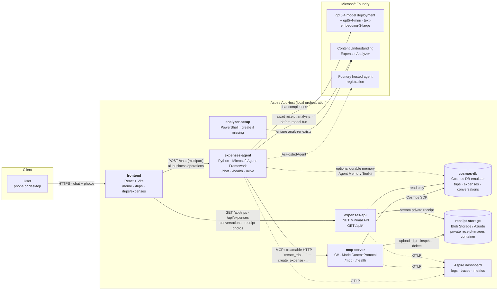

# Expenses tool demo

A proof of concept that turns **photos of receipts** into structured **expense
records**, grouped by **work trip**, through a chat conversation with an AI agent.

**The key flow:** store the original receipt, extract its fields with Content
Understanding (CU), then let the chat model use MCP tools to manage trips and
expenses. Receipt extraction finishes **before the chat model runs**; it is not
a tool the model chooses to call.

Start with [Running it](#running-it) for setup,
[How Content Understanding is called](#how-content-understanding-is-called) for
the receipt pipeline, or [Find CU calls in Aspire](#find-cu-calls-in-aspire) for
debugging.

It combines the following services:

| Product | Role in the demo |
| --- | --- |
| **Microsoft Agent Framework** (Python) | The expenses agent: chat loop, tool calling, context providers, conversation memory |
| **Microsoft Foundry** | Hosts GPT-5.4 (`gpt5-4`) and GPT-5.4 mini (`gpt5-4-mini`) deployments; the agent is published as a **Foundry hosted agent** |
| **Foundry Content Understanding** | Extracts merchant, category, totals and line items from each receipt photo |
| **Azure Cosmos DB** | Stores every trip, expense and conversation transcript (locally: the preview emulator on Podman) |
| **Azure Blob Storage** | Keeps original receipt images in a private container (locally: persistent Azurite on Podman) |
| **ASP.NET Core Minimal API** | Serves frontend reads directly from Cosmos and streams receipt images, without invoking the agent |

---

## Architecture



**Separation of concerns:** the agent uses MCP tools for every record operation.
The frontend reads trips, expenses and transcripts through the **read-only .NET
API**, directly from Cosmos, without an LLM or MCP round trip. Record mutations
go through chat to the agent, which invokes MCP tools to create, update or delete
records. Python exposes no record CRUD endpoints; its HTTP interface only
transports chat messages/photos and reports health. Shared C# models, queries
and serialization live in `expenses-data` so
the two services use the same Cosmos contract.

The MCP server stores uploaded image bytes **before** receipt analysis. Expenses
keep the original filename in `sourceImage` and a permanent private blob URL in
`photoUrl`. The URL contains no expiring SAS token. The UI displays the photo via
`GET /api/expenses/{id}/photo?userId=...`, so the storage container never needs
public access. Old expenses without `photoUrl` continue to work.

The one deliberate exception is **durable memory**: the Agent Memory Toolkit
(`CosmosMemoryContextProvider`) owns its own containers and connects to Cosmos
directly, because it manages its own vector-indexed schema. It is optional and
the agent degrades cleanly without it — see [Memory](#memory).

### One receipt, end to end

The Python service orchestrates the turn; the chat model starts only after all
attached receipts have been prepared. Attachments are processed sequentially.
This diagram shows a successful turn, including the extraction-cache path:

```mermaid
sequenceDiagram
    autonumber
    participant U as User
    participant FE as Frontend
  participant AG as Python service
    participant CU as Content Understanding
  participant LLM as Chat model (GPT-5.4)
    participant M as MCP server
    participant DB as Cosmos DB
    participant B as Private Blob Storage
    participant API as Read API

    U->>FE: Upload receipt and describe the trip
    FE->>AG: POST /chat (message + image, userId, conversationId)
    AG->>M: get_conversation (receipt checkpoints)
    M->>DB: Read conversation
    M-->>AG: Existing checkpoints, if any
    opt No upload checkpoint for this receipt
      AG->>M: upload_receipt_image (original bytes)
      M->>B: Store private image
      M-->>AG: Stored image reference and photoUrl
      AG->>M: save_receipt_checkpoint (image reference)
      M->>DB: Save checkpoint
    end
    alt Completed extraction exists
      AG->>AG: Reuse analysisJson; skip CU
    else Extraction needed
      AG->>AG: Prepare analysis copy; call CU provider.before_run
      AG->>CU: Submit image to ExpensesAnalyzer via SDK
      loop Until analysis completes or fails
        AG->>CU: Poll analysis status via SDK
        CU-->>AG: Status and result when ready
      end
      AG->>AG: Validate source and fields; convert to compact JSON
      AG->>M: save_receipt_checkpoint (analysisJson)
      M->>DB: Save completed extraction
    end
    AG->>AG: Agent.run with message, fields and receipt references
    AG->>M: get_conversation (history provider)
    M->>DB: Read transcript
    M-->>AG: Conversation history
    loop Model and tool rounds as needed
      AG->>LLM: Send context and available tools
      LLM-->>AG: Tool request or reply
      opt Model requests a record tool
        AG->>M: find_trip_by_name / create_trip / create_expense
        M->>DB: Query or write records
        M-->>AG: Tool result
      end
    end
    AG->>M: append_conversation_messages
    M->>DB: Save transcript
    AG-->>FE: Reply and tool-call names
    FE-->>U: Confirmation or clarification question
    FE->>API: GET /api/expenses/{id}
    API->>DB: read expense
    FE->>API: GET /api/expenses/{id}/photo
    API->>B: download private image
    API-->>FE: image bytes
```

  If extraction or validation fails, the turn stops before the chat model and
  model-selected record tools run. The uploaded image and its checkpoint may
  already exist. If the trip is unclear, the model can ask for clarification rather
  than create an expense; saved receipt context supports the next text turn.

---

## Repository layout

```
src/
  aspire/            # Aspire AppHost (file-based C#) – wires every resource together
  python-agent/      # The expenses agent (Python, Microsoft Agent Framework)
  mcp-server/        # MCP server (C#) – record mutations and blob tools
  expenses-api/      # Read-only .NET Minimal API for frontend queries and photos
  expenses-data/     # Shared Cosmos models/repositories and receipt storage
  frontend/          # React + Vite chat UI and expense views
  servicedefaults/   # Shared Aspire service defaults (OpenTelemetry, health checks)
  analyzers/         # Expenses.json – the Content Understanding analyzer definition
scripts/
  Initialize-ExpensesAnalyzer.ps1 # Idempotent setup run by the Aspire AppHost
docs/
  SETUP.md           # Step-by-step setup instructions
```

---

## Components

### Frontend (`src/frontend`, React + Vite)

| Route | Purpose |
| --- | --- |
| `/home` | Chat with the agent. Take a photo with the built-in camera or upload from the device; works on phones and desktops. |
| `/trips` | Every work trip as a card, with its expense count and total. |
| `/trips/expenses` | All expenses as a table, filterable by trip. |
| `/trips/expenses/{expenseId}` | One expense: merchant, total, category, trip, and its line items. |

The Vite dev server **proxies** `/chat` and `/health` to the agent,
and `/api` to the read API (`vite.config.ts`), keeping requests same-origin.
That is what lets you open the app
from your phone on the same network without CORS or mixed-content problems.

Chat state survives navigation between views: drafts, attachments, conversation
IDs and in-flight requests live in a shared React provider. This UI state is
in memory, not persisted across a full browser reload; saved conversations and
records remain in Cosmos.

### Agent (`src/python-agent`, Microsoft Agent Framework)

* `POST /chat` — one chat turn: `userId`, `message`, optional `conversationId`, optional `images[]`.
* `GET /health` — readiness, including which endpoints were resolved.
* `GET /alive` — process liveness.

There are no record read or mutation routes in the Python service. For example,
requesting a deletion in chat lets the agent resolve the record and invoke
`delete_trip` or `delete_expense` on the MCP server. The MCP server owns validation
and persistence; a chat response is not itself proof that a mutation succeeded.

Composition:

* **`FoundryChatClient`** against the `gpt5-4` deployment (GPT-5.4).
* **`ContentUnderstandingContextProvider`** is called explicitly by the receipt
  pipeline, not registered in `Agent(context_providers=...)` and not exposed as
  a model tool. It analyzes each uncached photo with `ExpensesAnalyzer` and waits
  for completion (`max_wait=None`). Its result is stripped down through
  `azure.ai.contentunderstanding.to_llm_input` to **fields only** (no page
  markdown), which is what `CONTENT_UNDERSTANDING_OUTPUT_SECTIONS=fields` selects.
  Aspire runs the PowerShell `analyzer-setup` resource independently of the agent.
  It reports an existing analyzer without modifying it, or creates a missing one
  and waits for readiness. Python does not manage or wait for analyzer setup;
  receipt analysis requires the analyzer to be available when a photo is submitted.
* **`MCPStreamableHTTPTool`** exposes four receipt-workflow tools on photo-upload
  turns (`create_trip`, `list_trips`, `find_trip_by_name`, `create_expense`). Text
  turns retain the full business tool set for updates, deletes and follow-ups.
* **Deterministic receipt conversion** validates the extraction's source and
  converts its YAML fields to compact JSON in Python, without a model tool round.
  Failed or empty extraction stops the turn before any chat-model request.
* **`SessionScopedHistoryProvider`** loads and saves the verbatim transcript
  through the MCP server. The Agent Framework session id carries
  `<userId>::<conversationId>`.
  Receipt URLs and extraction output are stored separately in `receiptContext`,
  keeping follow-up trip clarification grounded without replacing the user's
  displayed text with JSON/YAML.

The AppHost publishes it to Foundry with **`.AsHostedAgent(project)`**. The
[Dockerfile](src/python-agent/Dockerfile) uses `src` as its build context and
installs the Python package with the standard Hatchling backend. No custom build
hook or bundled analyzer JSON is needed: the runtime calls an existing remote
analyzer, while the PowerShell script owns provisioning.

#### How Content Understanding is called

The controlling code is [agent.py](src/python-agent/expenses_agent/agent.py), in
`ExpensesAgent.chat` and `_prepare_receipt`:

1. Load the conversation's receipt checkpoints. Store the original image via MCP
  if no upload checkpoint exists.
2. Reuse `analysisJson` if completed extraction is already cached. Otherwise,
  prepare a CU-compatible copy and put it in a temporary `SessionContext`.
3. Explicitly await `self._cu.before_run(...)`. The provider detects the image,
  submits it to the CU endpoint through the Azure SDK, and polls for the result.
  Authentication uses `DefaultAzureCredential`.
4. Validate the returned source and fields, convert the provider's fields-only
  YAML into compact JSON, and save it in the receipt checkpoint.
5. Call `self._agent.run(...)` with the user's text, extracted JSON and stored
  receipt references. The chat model receives this text, not the original image.
  Registered history and optional memory providers supply additional context.

This is a normal authenticated CU analysis request, not an autonomous agent
action. CU runs a long-running operation on the server, but `max_wait=None`
makes this chat turn wait for completion. The chat model does **not** run in
parallel with extraction. Python uses `await`, so waiting on CU does not block
the event loop from handling other requests.

**How would a registered context provider differ?** Agent Framework would call
`before_run` automatically on image-bearing input. With the same `max_wait=None`,
it would still wait before invoking the model. The explicit pipeline keeps
storage, extraction reuse, validation and failure handling under application
control before model invocation. The provider still handles file detection,
SDK calls, polling and formatting; the CU analysis itself is unchanged.

The provider also supports a finite `max_wait`, which can defer an unfinished
analysis and check it on a later turn. **This demo does not use that mode** or
persist CU continuation tokens. See [Token budgets and retries](#token-budgets-and-retries)
for what a retry can and cannot reuse.

#### Agent file guide

Every maintained file under [src/python-agent](src/python-agent) has a specific role:

| File | Purpose |
| --- | --- |
| [main.py](src/python-agent/expenses_agent/main.py) | Process entry point. Loads settings, builds the app and starts Uvicorn. Supports both direct execution by Aspire and module execution. |
| [api.py](src/python-agent/expenses_agent/api.py) | Thin chat transport, not a record CRUD API. Owns the agent lifecycle, accepts multipart text/photos, validates uploads, forwards turns to `ExpensesAgent.chat`, translates errors and exposes health endpoints. |
| [agent.py](src/python-agent/expenses_agent/agent.py) | Orchestration and model instructions. Uploads receipts, reuses checkpoints or explicitly awaits CU, validates extraction, then runs the model with per-turn MCP tools. Registers history and optional memory providers. |
| [mcp_client.py](src/python-agent/expenses_agent/mcp_client.py) | Typed MCP transport for deterministic receipt uploads, checkpoints and transcript reads/writes. Opens short-lived sessions and unwraps tool results/errors. Model-selected record operations use `MCPStreamableHTTPTool` in the agent instead. |
| [history.py](src/python-agent/expenses_agent/history.py) | Loads and saves conversations through MCP. Replays whole recent turns within a token/message budget, retaining only the latest receipt's detailed context and keeping tool-call names for display. |
| [memory.py](src/python-agent/expenses_agent/memory.py) | Optional semantic memory across conversations. The Agent Memory Toolkit owns separate Cosmos containers and connects directly to them, not through MCP. Failures disable this layer without disabling transcript history. |
| [config.py](src/python-agent/expenses_agent/config.py) | Resolves settings from environment variables and Aspire service discovery/connection strings. Supplies model, MCP, memory, telemetry and server options, plus a non-secret configuration summary. |
| [images.py](src/python-agent/expenses_agent/images.py) | Uses Pillow to verify image type/integrity and guard against oversized decoded images. Converts GIF/WebP to PNG for analysis only; uploaded originals remain unchanged in storage. |
| [observability.py](src/python-agent/expenses_agent/observability.py) | Configures OpenTelemetry, instruments FastAPI/httpx, and adds httpx2 model-attempt spans, Content Understanding response events, usage counters and allowlisted rate-limit headers. |
| [__init__.py](src/python-agent/expenses_agent/__init__.py) | Declares the Python package and its version. |
| [tools/parser_tool.py](src/python-agent/expenses_agent/tools/parser_tool.py) | Deterministic YAML helpers, including receipt source/fields validation and compact JSON conversion. Not exposed as a model tool. |
| [tools/__init__.py](src/python-agent/expenses_agent/tools/__init__.py) | Exports local parser helper aliases. Business CRUD tools live in the C# MCP server. |
| [pyproject.toml](src/python-agent/pyproject.toml) | Declares Python compatibility, dependencies, Hatch packaging, prerelease support for uv and the agent command-line entry point. |
| [Dockerfile](src/python-agent/Dockerfile) | Packages the agent using `src` as its build context, installs dependencies and starts the agent as a non-root user. Analyzer provisioning is separate. |

Python startup follows `main` -> configuration and chat transport -> `ExpensesAgent.start`.
The independent `analyzer-setup` resource does not block Python startup.
A receipt turn follows chat transport -> upload/checkpoint -> awaited CU analysis
(unless cached) -> validation/checkpoint -> model and MCP tool loop -> transcript
persistence. Text-only turns skip receipt preparation. Uploads and persistence also
use MCP but are deterministic orchestration steps, not decisions delegated to the
model. The .NET read API is independent of this path.

The analyzer schema itself lives in
[src/analyzers/Expenses.json](src/analyzers/Expenses.json). Its remote ID remains
`ExpensesAnalyzer`. Setup lives in
[scripts/Initialize-ExpensesAnalyzer.ps1](scripts/Initialize-ExpensesAnalyzer.ps1).
The AppHost passes the Content Understanding account endpoint, definition path,
analyzer ID and model deployment names as PowerShell arguments. PowerShell
resources are local-only; run the same script before starting a published agent
against a new account (see [Analyzer initialization](docs/SETUP.md#analyzer-initialization)).
Folders such as `.venv`, `__pycache__` and `.pytest_cache` are generated local
dependencies/caches, not additional agent components.

### Read API (`src/expenses-api`, .NET)

GET-only routes preserve the existing frontend response shapes, including trip
expense counts and totals:

* `/api/trips[/{id}]`, `/api/expenses[/{id}]`
* `/api/conversations[/{id}]`
* `/api/expenses/{id}/photo`

All reads require `userId` and use its Cosmos partition. Photo downloads first
resolve the expense in that partition and only accept URLs in the configured
receipt container and that user's blob prefix. The API does not initialize or
modify containers; MCP startup does that. It can keep serving reads when chat or
Foundry is unavailable.

### Memory

The agent uses two complementary layers:

| Layer | What it does | Where it lives |
| --- | --- | --- |
| **Verbatim transcript** (`SessionScopedHistoryProvider`) | Stores the transcript and replays whole recent turns within 40 messages and the configured token budget. Older receipt detail blocks are omitted from replay, not deleted from storage. | `conversations` container, written **via MCP** |
| **Durable memory** (`CosmosMemoryContextProvider`, Agent Memory Toolkit) | Vector-searches previous turns and injects the relevant facts, procedures and user profile — recall *across* conversations. | `memories_*` containers, **directly in Cosmos** |

Durable memory is optional and controlled by environment variables:

| Variable | Default | Meaning |
| --- | --- | --- |
| `ENABLE_COSMOS_MEMORY` | `true` | Turn the durable layer on or off |
| `MEMORY_CHAT_MODEL` | `gpt5-4-mini` (AppHost) | GPT-5.4 mini deployment used for fact extraction and summaries |
| `MEMORY_EMBEDDING_MODEL` | `TextEmbedding3Large` (AppHost) | Deployment used to embed turns |
| `MEMORY_TOP_K` | `5` | How many memories to inject per turn |

> **Local default:** the AppHost sets `ENABLE_COSMOS_MEMORY=false` for local runs
> because the preview emulator rejects the toolkit's vector/full-text indexing
> policy. `/health` reports `durableMemory: false`; transcript history still works
> through MCP. Published runs enable durable memory. Testing it locally requires
> a supported Cosmos backend, a Cosmos reference on the Python resource, and
> enabling the setting; see [Python setup](docs/SETUP.md#4-python-virtual-environment).

### Token budgets and retries

| Variable | Default | Purpose |
| --- | --- | --- |
| `MODEL_MAX_OUTPUT_TOKENS` | `2048` | Per-model-response budget, including reasoning; range 256-16384 |
| `MODEL_REASONING_EFFORT` | `low` | `none`, `low`, `medium` or `high` |
| `MODEL_MAX_RETRIES` | `2` | OpenAI SDK retries, honoring supported retry headers; range 0-5 |
| `MAX_HISTORY_TOKENS` | `4096` | Estimated replay budget using `o200k_base`; range 256-32768 |
| `RECEIPT_CACHE_VERSION` | `1` | Increment when changing an analyzer definition in place to invalidate prior extraction checkpoints |

For Aspire-managed runs, pass overrides to the Python resource using
`.WithEnvironment(...)`. These budgets do not include tool schemas or the current
user turn, and do not change Azure deployment quotas. If the latest history turn
alone exceeds its budget, the agent reports an error rather than cutting receipt
JSON or identifiers in half. Output-budget exhaustion is also reported explicitly;
check records before retrying because earlier tool calls may already have succeeded.

Receipt upload references and successful compact extraction results are saved via
`save_receipt_checkpoint` in the conversation's `receiptCheckpoints`, separate from
messages. Re-uploading identical content with the same filename in the same user's
conversation reuses these checkpoints, including after an agent restart. Each
conversation retains its latest 16 checkpoints with at most 32 KiB of extracted JSON
per checkpoint. The cache key also includes the declared image type, analyzer
endpoint/ID, output sections and cache version. Cosmos writes use ETags so checkpoint and transcript writes do not
silently overwrite one another.

The browser assigns a conversation ID before its first send and retains the draft
and attachments on failure. HTTP 429 responses expose `Retry-After` (provider delay
when available, otherwise 60 seconds). There is no automatic retry of a complete
business workflow. Checkpoints are not exactly-once guarantees for record mutations,
and in-flight analysis is not resumed after a crash; only completed extraction is
reused. A new browser conversation has a different checkpoint scope.

GPT-5.4 remains the chat model. To evaluate GPT-5.4 mini for orchestration, override
`FOUNDRY_DEPLOYMENT=gpt5-4-mini` and compare extraction follow-ups and tool accuracy
before adopting it. This does not change the analyzer's model deployment.

### MCP server (`src/mcp-server`, C#)

Streamable HTTP MCP endpoint on `/mcp`, plus `/health`. Tools:

| Area | Tools |
| --- | --- |
| Trips | `create_trip`, `list_trips`, `get_trip`, `find_trip_by_name`, `update_trip`, `delete_trip` |
| Expenses | `create_expense`, `list_expenses`, `get_expense`, `update_expense`, `delete_expense` |
| Conversations | `append_conversation_messages`, `get_conversation`, `list_conversations`, `delete_conversation`, `save_receipt_checkpoint` |
| Receipt images | `upload_receipt_image`, `get_receipt_image`, `list_receipt_images`, `delete_receipt_image` |

Not every server tool is exposed to the model. Receipt uploads, checkpoints and
transcript persistence are deterministic application calls. Photo turns expose
only `create_trip`, `list_trips`, `find_trip_by_name` and `create_expense`; text
turns expose the broader trip/expense CRUD and receipt inspection/cleanup tools.

`create_expense` refuses to store an expense whose trip does not exist, and
`delete_trip` cascades to that trip's expenses.

Receipt uploads accept JPEG, PNG, GIF, WebP, BMP and TIFF up to 12 MB, checking
both the declared content type and image signature. Unique blob names prevent
duplicate filenames from overwriting one another. User/conversation prefixes
and original filename metadata make uploads discoverable, including receipts
awaiting trip clarification.
Python additionally verifies image integrity and converts GIF/WebP to PNG only
for analysis; Blob Storage keeps the original uploaded bytes.

Deleting an expense or trip **retains its original photos** for traceability.
Use `delete_receipt_image` for explicit cleanup; it refuses to delete an image
while an expense still references it.

### Cosmos DB

Database `db`, three containers, all partitioned by `/userId`:

| Container | Document |
| --- | --- |
| `trips` | `id`, `userId`, `name`, `destination`, `startDate`, `endDate`, `purpose`, `currency`, `status` |
| `expenses` | `id`, `userId`, `tripId`, `merchant`, `category`, `date`, `totalAmount`, `currency`, `lineItems[]`, `notes`, `sourceImage`, `photoUrl`, `conversationId`, `createdAt`, `updatedAt` |
| `conversations` | `id`, `userId`, `title`, `tripId`, `messages[]` (`role`, `text`, optional `receiptContext`, `toolCalls[]`, `attachments[]`), `receiptCheckpoints` |

An expense always carries a `tripId`, so the Munich trip and the Seattle trip
never mix — that is the grouping the demo is built around.

### Dependency configuration

Aspire `.WithReference()` supplies Cosmos and Blob Storage connection information
to the two .NET services, model deployment connection strings to Python, and
service-discovery URLs to Python/Vite. The C# clients use Aspire DI registrations
(`AddAzureCosmosClient`, `AddAzureBlobContainerClient`), not manually copied keys.
The receipt container's endpoint and name both come from its resource reference.
The read API receives Blob Data Reader permissions when published.

The agent receives **no blob credentials** and, while local durable memory is
disabled, **no Cosmos credentials**. A published agent receives Cosmos only for
its optional durable-memory layer. The existing Content Understanding endpoint
parameter remains explicit: it targets the AI Services account, whereas the chat
connection targets a Foundry project. Database/container names are non-secret
configuration, not connection strings.

---

## Logging and tracing

The instrumented backend services export OTLP to the Aspire dashboard. Python
uses HTTP/protobuf via the endpoint injected by the AppHost.

| Operation | What you see |
| --- | --- |
| Every user ↔ agent message | Log line per turn plus an `agent.chat` span tagged with user, conversation, attachment count and the tools invoked |
| Agent tool calls | Agent Framework spans for each function/MCP invocation; `mcp.call_tool <name>` spans for deterministic MCP calls, including uploads, checkpoints and history |
| Record CRUD | `records.<entity>.<operation>` spans from `Expenses.Data` in MCP/read API plus a log line with the Cosmos request charge |
| Receipt analysis stage | `receipt.analyze` with checkpoint-hit status; includes preparation, CU analysis, validation and saving extracted JSON, or returns cached JSON |
| Content Understanding responses | `receipt.http` events on the active span, with HTTP status and allowlisted request/retry headers; `receipt.usage.*` when the service returns usage |
| Model HTTP attempts | `model.http` spans for httpx2 requests, including retries, status, allowlisted request IDs/rate-limit headers and `model.usage.*` on successful responses |
| HTTP in/out | FastAPI + httpx instrumentation (Python), ASP.NET Core + HttpClient instrumentation (C#) |

Sensitive-data capture (prompts and completions) is on by default for the demo.
The custom HTTP telemetry does not record request/response bodies, authorization
headers or cookies. Model HTTP usage duplicates the same successful call represented
by the framework's `gen_ai.usage.*`; do not sum both when calculating totals.

### Find CU calls in Aspire

1. Open **Traces** and select the **expenses-agent** resource.
2. Search for `receipt.analyze`. Results are whole traces containing matching
  spans, not isolated CU requests.
3. Use **Add filter**: parameter `receipt.checkpoint_hit`, condition **Equals**,
  value `false` (select the displayed boolean value). Use `true` to investigate
  extraction reuse instead.
4. Open a matching trace. In the trace detail's span filter, enter
  `receipt.analyze` to locate the stage; clear it to inspect surrounding work.
5. Open the span details and inspect timing, status, attributes and events.
  If SDK instrumentation creates child spans, inspect those for CU events too.

| Evidence | Interpretation |
| --- | --- |
| `receipt.checkpoint_hit=true` | Completed JSON was reused; this span made no CU call. |
| `receipt.checkpoint_hit=false` | Extraction was needed. Image preparation can still fail before a CU request. |
| `receipt.http` event | A CU HTTP response was received. This is an event, not a separate span. Multiple events can represent polling or retries, not multiple image submissions. |
| Event `http.response.status_code` | HTTP response status, not necessarily final analysis success. Check the overall span and any exception too. |
| Event `http.response.header.x-ms-request-id` / `http.response.header.apim-request-id` | Azure request identifiers, when returned. |
| Event `http.response.header.retry-after` / `http.response.header.retry-after-ms` | Service retry guidance, when returned. |
| `receipt.usage.*` | Usage returned by CU, when present. |
| `receipt.fields_characters` | Length of newly extracted JSON after its checkpoint was saved; absent on the cache-hit return path. |

Use the span's start time and timeline to see **when** the stage ran. Its duration
includes local conversion/validation and saving JSON, so it is not pure CU service
latency. The parent `agent.chat` span has `expenses.conversation_id` and
`expenses.attachment_count` for correlation. Model spans follow successful receipt
preparation; text-only turns have no `receipt.analyze` spans. CU is not a model
tool or a registered provider in this app, so filter by this explicit stage.

## Known limitations

* **Model quota.** A busy `gpt5-4` deployment returns HTTP 429; the agent surfaces
  that as a `429` with a clear message rather than a generic 500.
* **Durable memory on the emulator.** See the caveat under [Memory](#memory).
* **No authentication.** The browser generates a random `userId` and stores it in
  `localStorage`; it is the Cosmos partition key. Add real auth before using this
  for anything beyond a demo.

---

## Running it

See [docs/SETUP.md](docs/SETUP.md) for prerequisites, credentials and environment
setup. After completing those steps, start the application:

```bash
cd src/aspire
aspire run
```

Aspire starts the Cosmos and Azurite emulators on **Podman**, the MCP server,
read API, Python agent and Vite frontend, then prints the dashboard URL. Open the **frontend**
endpoint and go to `/home`.

Wait for `analyzer-setup` to report success before submitting receipts against
a new account. Python readiness alone does not prove the analyzer exists.
Setup does not overwrite an existing analyzer.

### Build and smoke check

The previous unit-test suites and their test-only dependencies have been removed.
From the repository root, after installing dependencies:

```powershell
dotnet build .\src.slnx -c Release
dotnet build .\src\aspire\apphost.cs -c Release
.\src\python-agent\.venv\Scripts\python -m compileall -q .\src\python-agent\expenses_agent
npm --prefix .\src\frontend run build
```

These checks compile/build the code; they do not verify live Azure calls. With
Aspire running, check the workflow manually:

1. Submit a test receipt with enough trip information. Confirm `receipt.analyze`
  precedes model activity and has `receipt.checkpoint_hit=false`.
2. Open the resulting expense and its photo. Reload the view to confirm records
  and original images are persisted.
3. Send a text-only follow-up. Confirm history is available and CU is not invoked.
4. Navigate between chat and expense views while a turn is running. Return to
  chat and confirm its in-flight state and response are retained.
5. Before retrying a failed turn, inspect existing records. The same image,
  filename, type and analyzer settings in the same conversation should reuse
  completed extraction (`receipt.checkpoint_hit=true`). Retrying a successful
  expense-creation request can still create duplicate records.

Checkpoints do not provide an exactly-once business transaction guarantee.
Verify MCP results and stored records, not only the model's reply.
