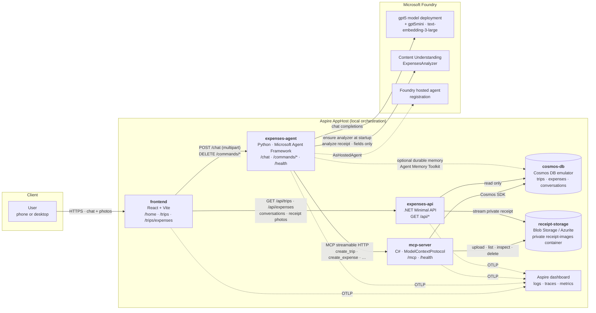
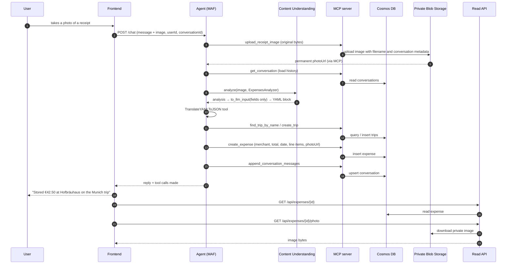

# Expenses tool demo

A proof of concept that turns **photos of receipts** into structured **expense
records**, grouped by **work trip**, through a chat conversation with an AI agent.

It combines the following services:

| Product | Role in the demo |
| --- | --- |
| **Microsoft Agent Framework** (Python) | The expenses agent: chat loop, tool calling, context providers, conversation memory |
| **Microsoft Foundry** | Hosts the `gpt5` model deployment; the agent is published as a **Foundry hosted agent** |
| **Foundry Content Understanding** | Extracts merchant, category, totals and line items from each receipt photo |
| **Azure Cosmos DB** | Stores every trip, expense and conversation transcript (locally: the preview emulator on Podman) |
| **Azure Blob Storage** | Keeps original receipt images in a private container (locally: persistent Azurite on Podman) |
| **ASP.NET Core Minimal API** | Serves frontend reads directly from Cosmos and streams receipt images, without invoking the agent |

---

## Architecture



**Separation of concerns:** the agent uses MCP tools for every record operation.
The frontend reads trips, expenses and transcripts through the **read-only .NET
API**, directly from Cosmos, without an LLM or MCP round trip. Record mutations
remain in MCP; the existing delete buttons use the agent's small `/commands`
adapter. Shared C# models, queries and serialization live in `expenses-data` so
the two services use the same Cosmos contract.

The MCP server stores uploaded image bytes **before** receipt analysis. Expenses
keep the original filename in `sourceImage` and a permanent private blob URL in
`photoUrl`. The URL contains no expiring SAS token. The UI displays the photo via
`GET /api/expenses/{id}/photo?userId=...`, so the storage container never needs
public access. Old expenses without `photoUrl` continue to work.

The one deliberate exception is **durable memory**: the Agent Memory Toolkit
(`CosmosMemoryContextProvider`) owns its own containers and connects to Cosmos
directly, because it manages its own vector-indexed schema. It is optional and
the agent degrades cleanly without it — see [Memory](#memory).

### One receipt, end to end



---

## Repository layout

```
src/
  aspire/            # Aspire AppHost (file-based C#) – wires every resource together
  python-agent/      # The expenses agent (Python, Microsoft Agent Framework)
  mcp-server/        # MCP server (C#) – record mutations and blob tools
  expenses-api/      # Read-only .NET Minimal API for frontend queries and photos
  expenses-data/     # Shared Cosmos models/repositories and receipt storage
  frontend/          # React + Vite chat UI and expense views
  servicedefaults/   # Shared Aspire service defaults (OpenTelemetry, health checks)
  analyzers/         # ExpensesAnalyzer.json – the Content Understanding analyzer definition
docs/
  SETUP.md           # Step-by-step setup instructions
```

---

## Components

### Frontend (`src/frontend`, React + Vite)

| Route | Purpose |
| --- | --- |
| `/home` | Chat with the agent. Take a photo with the built-in camera or upload from the device; works on phones and desktops. |
| `/trips` | Every work trip as a card, with its expense count and total. |
| `/trips/expenses` | All expenses as a table, filterable by trip. |
| `/trips/expenses/{expenseId}` | One expense: merchant, total, category, trip, and its line items. |

The Vite dev server **proxies** `/chat`, `/commands` and `/health` to the agent,
and `/api` to the read API (`vite.config.ts`), keeping requests same-origin.
That is what lets you open the app
from your phone on the same network without CORS or mixed-content problems.

### Agent (`src/python-agent`, Microsoft Agent Framework)

* `POST /chat` — one chat turn: `userId`, `message`, optional `conversationId`, optional `images[]`.
* `GET /health` — readiness, including which endpoints were resolved.
* `DELETE /commands/trips/{id}`, `/commands/expenses/{id}` — existing delete-button operations, forwarded to MCP without a model call.

There are no `/api` read routes in the Python service.

Composition:

* **`FoundryChatClient`** against the `gpt5` deployment.
* **`ContentUnderstandingContextProvider`** analyses each attached photo with the
  `ExpensesAnalyzer`. Its result is stripped down through
  `azure.ai.contentunderstanding.to_llm_input` to **fields only** (no page
  markdown), which is what `CONTENT_UNDERSTANDING_OUTPUT_SECTIONS=fields` selects.
  Startup ensures the analyzer exists and is ready before chat becomes available;
  existing analyzers are not overwritten.
* **`MCPStreamableHTTPTool`** exposes the MCP server's CRUD tools to the model.
* **`TranslateYAMLToJSON`** local tool converts the injected YAML into JSON.
* **`SessionScopedHistoryProvider`** loads and saves the verbatim transcript
  through the MCP server. The Agent Framework session id carries
  `<userId>::<conversationId>`.
  Receipt URLs and extraction output are stored separately in `receiptContext`,
  keeping follow-up trip clarification grounded without replacing the user's
  displayed text with JSON/YAML.

The AppHost publishes it to Foundry with **`.AsHostedAgent(project)`**. Its custom
Dockerfile uses `src` as the build context so the canonical analyzer definition
and Python packaging hook are included before dependency installation.

### Read API (`src/expenses-api`, .NET)

GET-only routes preserve the existing frontend response shapes, including trip
expense counts and totals:

* `/api/trips[/{id}]`, `/api/expenses[/{id}]`
* `/api/conversations[/{id}]`
* `/api/expenses/{id}/photo`

All reads require `userId` and use its Cosmos partition. Photo downloads first
resolve the expense in that partition and only accept URLs in the configured
receipt container and that user's blob prefix. The API does not initialize or
modify containers; MCP startup does that. It can keep serving reads when chat or
Foundry is unavailable.

### Memory

The agent uses two complementary layers:

| Layer | What it does | Where it lives |
| --- | --- | --- |
| **Verbatim transcript** (`SessionScopedHistoryProvider`) | Replays the last N literal user/assistant turns, so "yes, use that trip" resolves. The UI reads transcripts through the read API. | `conversations` container, written **via MCP** |
| **Durable memory** (`CosmosMemoryContextProvider`, Agent Memory Toolkit) | Vector-searches previous turns and injects the relevant facts, procedures and user profile — recall *across* conversations. | `memories_*` containers, **directly in Cosmos** |

Durable memory is optional and controlled by environment variables:

| Variable | Default | Meaning |
| --- | --- | --- |
| `ENABLE_COSMOS_MEMORY` | `true` | Turn the durable layer on or off |
| `MEMORY_CHAT_MODEL` | `gpt5mini` (AppHost) | Deployment used for fact extraction and summaries |
| `MEMORY_EMBEDDING_MODEL` | `TextEmbedding3Large` (AppHost) | Deployment used to embed turns |
| `MEMORY_TOP_K` | `5` | How many memories to inject per turn |

> **Local emulator caveat:** the toolkit creates vector-indexed containers, which
> the Cosmos **preview emulator rejects** (`Failed to parse indexing policy`). The
> agent logs a warning, reports `durableMemory: false` on `/health`, and carries on
> with the verbatim transcript. Point it at a real Cosmos account (or an emulator
> build with vector search) to see it work.

### MCP server (`src/mcp-server`, C#)

Streamable HTTP MCP endpoint on `/mcp`, plus `/health`. Tools:

| Area | Tools |
| --- | --- |
| Trips | `create_trip`, `list_trips`, `get_trip`, `find_trip_by_name`, `update_trip`, `delete_trip` |
| Expenses | `create_expense`, `list_expenses`, `get_expense`, `update_expense`, `delete_expense` |
| Conversations | `append_conversation_messages`, `get_conversation`, `list_conversations`, `delete_conversation` |
| Receipt images | `upload_receipt_image`, `get_receipt_image`, `list_receipt_images`, `delete_receipt_image` |

`create_expense` refuses to store an expense whose trip does not exist, and
`delete_trip` cascades to that trip's expenses.

Receipt uploads accept JPEG, PNG, GIF, WebP, BMP and TIFF up to 12 MB, checking
both the declared content type and image signature. Unique blob names prevent
duplicate filenames from overwriting one another. User/conversation prefixes
and original filename metadata make uploads discoverable, including receipts
awaiting trip clarification.
Python additionally verifies image integrity and converts GIF/WebP to PNG only
for analysis; Blob Storage keeps the original uploaded bytes.

Deleting an expense or trip **retains its original photos** for traceability.
Use `delete_receipt_image` for explicit cleanup; it refuses to delete an image
while an expense still references it.

### Cosmos DB

Database `db`, three containers, all partitioned by `/userId`:

| Container | Document |
| --- | --- |
| `trips` | `id`, `userId`, `name`, `destination`, `startDate`, `endDate`, `purpose`, `currency`, `status` |
| `expenses` | `id`, `userId`, `tripId`, `merchant`, `category`, `date`, `totalAmount`, `currency`, `lineItems[]`, `notes`, `sourceImage`, `photoUrl`, `conversationId`, `createdAt`, `updatedAt` |
| `conversations` | `id`, `userId`, `title`, `tripId`, `messages[]` (`role`, `text`, optional `receiptContext`, `toolCalls[]`, `attachments[]`) |

An expense always carries a `tripId`, so the Munich trip and the Seattle trip
never mix — that is the grouping the demo is built around.

### Dependency configuration

Aspire `.WithReference()` supplies Cosmos and Blob Storage connection information
to the two .NET services, model deployment connection strings to Python, and
service-discovery URLs to Python/Vite. The C# clients use Aspire DI registrations
(`AddAzureCosmosClient`, `AddAzureBlobContainerClient`), not manually copied keys.
The receipt container's endpoint and name both come from its resource reference.
The read API receives Blob Data Reader permissions when published.

The agent receives **no blob credentials** and, while local durable memory is
disabled, **no Cosmos credentials**. A published agent receives Cosmos only for
its optional durable-memory layer. The existing Content Understanding endpoint
parameter remains explicit: it targets the AI Services account, whereas the chat
connection targets a Foundry project. Database/container names are non-secret
configuration, not connection strings.

---

## Logging and tracing

Everything exports OTLP to the Aspire dashboard.

| Operation | What you see |
| --- | --- |
| Every user ↔ agent message | Log line per turn plus an `agent.chat` span tagged with user, conversation, attachment count and the tools invoked |
| Agent tool calls | Agent Framework spans for each function/MCP invocation; `mcp.call_tool <name>` spans for the agent's own MCP reads |
| Record CRUD | `records.<entity>.<operation>` spans from `Expenses.Data` in MCP/read API plus a log line with the Cosmos request charge |
| Content Understanding calls | Agent Framework context-provider spans around the analyze call |
| HTTP in/out | FastAPI + httpx instrumentation (Python), ASP.NET Core + HttpClient instrumentation (C#) |

Sensitive-data capture (prompts and completions) is on by default for the demo.

## Known limitations

* **Model quota.** A busy `gpt5` deployment returns HTTP 429; the agent surfaces
  that as a `429` with a clear message rather than a generic 500.
* **Durable memory on the emulator.** See the caveat under [Memory](#memory).
* **No authentication.** The browser generates a random `userId` and stores it in
  `localStorage`; it is the Cosmos partition key. Add real auth before using this
  for anything beyond a demo.

---

## Running it

See [`docs/SETUP.md`](docs/SETUP.md) for the full walkthrough. The short version:

```bash
cd src/aspire
aspire run
```

Aspire starts the Cosmos and Azurite emulators on **Podman**, the MCP server,
read API, Python agent and Vite frontend, then prints the dashboard URL. Open the **frontend**
endpoint and go to `/home`.

---

The previous unit-test suites and their test-only dependencies have been removed.
Build and manual smoke-run instructions are in [`docs/SETUP.md`](docs/SETUP.md).
