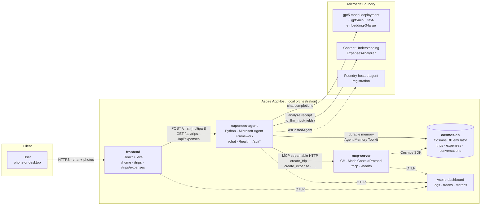
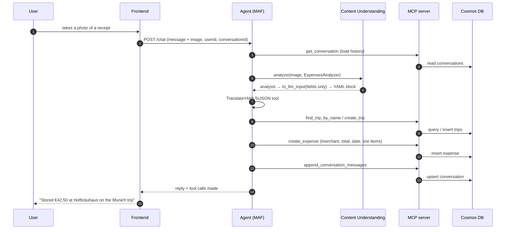

# Expenses tool demo

A proof of concept that turns **photos of receipts** into structured **expense
records**, grouped by **work trip**, through a chat conversation with an AI agent.

It showcases four Microsoft products working together:

| Product | Role in the demo |
| --- | --- |
| **Microsoft Agent Framework** (Python) | The expenses agent: chat loop, tool calling, context providers, conversation memory |
| **Microsoft Foundry** | Hosts the `gpt5` model deployment; the agent is published as a **Foundry hosted agent** |
| **Foundry Content Understanding** | Extracts merchant, category, totals and line items from each receipt photo |
| **Azure Cosmos DB** | Stores every trip, expense and conversation transcript (locally: the preview emulator on Podman) |

---

## Architecture



**The rule the architecture enforces:** the agent never opens a database
connection for **records**. Every trip and expense read or write — and the chat
transcript the UI renders — goes through the MCP server, which is the only
component holding a Cosmos client for those containers. The frontend in turn only
talks to the agent.

The one deliberate exception is **durable memory**: the Agent Memory Toolkit
(`CosmosMemoryContextProvider`) owns its own containers and connects to Cosmos
directly, because it manages its own vector-indexed schema. It is optional and
the agent degrades cleanly without it — see [Memory](#memory).

### One receipt, end to end



---

## Repository layout

```
src/
  aspire/            # Aspire AppHost (file-based C#) – wires every resource together
  python-agent/      # The expenses agent (Python, Microsoft Agent Framework)
  mcp-server/        # MCP server (C#) – CRUD tools over Cosmos DB
  mcp-server.tests/  # xUnit tests, including a real MCP protocol round-trip
  frontend/          # React + Vite chat UI and expense views
  servicedefaults/   # Shared Aspire service defaults (OpenTelemetry, health checks)
  analyzers/         # ExpensesAnalyzer.json – the Content Understanding analyzer definition
docs/
  SETUP.md           # Step-by-step setup instructions
```

---

## Components

### Frontend (`src/frontend`, React + Vite)

| Route | Purpose |
| --- | --- |
| `/home` | Chat with the agent. Take a photo with the built-in camera or upload from the device; works on phones and desktops. |
| `/trips` | Every work trip as a card, with its expense count and total. |
| `/trips/expenses` | All expenses as a table, filterable by trip. |
| `/trips/expenses/{expenseId}` | One expense: merchant, total, category, trip, and its line items. |

The Vite dev server **proxies** `/chat`, `/api` and `/health` to the agent
(`vite.config.ts`), so the API is same-origin. That is what lets you open the app
from your phone on the same network without CORS or mixed-content problems.

### Agent (`src/python-agent`, Microsoft Agent Framework)

* `POST /chat` — one chat turn: `userId`, `message`, optional `conversationId`, optional `images[]`.
* `GET /health` — readiness, including which endpoints were resolved.
* `GET /api/trips`, `/api/trips/{id}`, `/api/expenses`, `/api/expenses/{id}`, `/api/conversations[/{id}]` — thin read proxies over the MCP tools, used by the frontend pages.

Composition:

* **`FoundryChatClient`** against the `gpt5` deployment.
* **`ContentUnderstandingContextProvider`** analyses each attached photo with the
  `ExpensesAnalyzer`. Its result is stripped down through
  `azure.ai.contentunderstanding.to_llm_input` to **fields only** (no page
  markdown), which is what `CONTENT_UNDERSTANDING_OUTPUT_SECTIONS=fields` selects.
* **`MCPStreamableHTTPTool`** exposes the MCP server's CRUD tools to the model.
* **`TranslateYAMLToJSON`** local tool converts the injected YAML into JSON.
* **`SessionScopedHistoryProvider`** loads and saves the verbatim transcript
  through the MCP server. The Agent Framework session id carries
  `<userId>::<conversationId>`.

The AppHost publishes it to Foundry with **`.AsHostedAgent(project)`**.

### Memory

The agent uses two complementary layers:

| Layer | What it does | Where it lives |
| --- | --- | --- |
| **Verbatim transcript** (`SessionScopedHistoryProvider`) | Replays the last N literal user/assistant turns, so "yes, use that trip" resolves. Also the record the `/trips` UI renders. | `conversations` container, **via the MCP server** |
| **Durable memory** (`CosmosMemoryContextProvider`, Agent Memory Toolkit) | Vector-searches previous turns and injects the relevant facts, procedures and user profile — recall *across* conversations. | `memories_*` containers, **directly in Cosmos** |

Durable memory is optional and controlled by environment variables:

| Variable | Default | Meaning |
| --- | --- | --- |
| `ENABLE_COSMOS_MEMORY` | `true` | Turn the durable layer on or off |
| `MEMORY_CHAT_MODEL` | `gpt5mini` (AppHost) | Deployment used for fact extraction and summaries |
| `MEMORY_EMBEDDING_MODEL` | `TextEmbedding3Large` (AppHost) | Deployment used to embed turns |
| `MEMORY_TOP_K` | `5` | How many memories to inject per turn |

> **Local emulator caveat:** the toolkit creates vector-indexed containers, which
> the Cosmos **preview emulator rejects** (`Failed to parse indexing policy`). The
> agent logs a warning, reports `durableMemory: false` on `/health`, and carries on
> with the verbatim transcript. Point it at a real Cosmos account (or an emulator
> build with vector search) to see it work.

### MCP server (`src/mcp-server`, C#)

Streamable HTTP MCP endpoint on `/mcp`, plus `/health`. Tools:

| Area | Tools |
| --- | --- |
| Trips | `create_trip`, `list_trips`, `get_trip`, `find_trip_by_name`, `update_trip`, `delete_trip` |
| Expenses | `create_expense`, `list_expenses`, `get_expense`, `update_expense`, `delete_expense` |
| Conversations | `append_conversation_messages`, `get_conversation`, `list_conversations`, `delete_conversation` |

`create_expense` refuses to store an expense whose trip does not exist, and
`delete_trip` cascades to that trip's expenses.

### Cosmos DB

Database `db`, three containers, all partitioned by `/userId`:

| Container | Document |
| --- | --- |
| `trips` | `id`, `userId`, `name`, `destination`, `startDate`, `endDate`, `purpose`, `currency`, `status` |
| `expenses` | `id`, `userId`, `tripId`, `merchant`, `category`, `date`, `totalAmount`, `currency`, `lineItems[]`, `notes`, `sourceImage` |
| `conversations` | `id`, `userId`, `title`, `tripId`, `messages[]` (`role`, `text`, `toolCalls[]`, `attachments[]`) |

An expense always carries a `tripId`, so the Munich trip and the Seattle trip
never mix — that is the grouping the demo is built around.

---

## Logging and tracing

Everything exports OTLP to the Aspire dashboard.

| Operation | What you see |
| --- | --- |
| Every user ↔ agent message | Log line per turn plus an `agent.chat` span tagged with user, conversation, attachment count and the tools invoked |
| Agent tool calls | Agent Framework spans for each function/MCP invocation; `mcp.call_tool <name>` spans for the agent's own MCP reads |
| Record CRUD | `records.<entity>.<operation>` spans from `ExpensesMcpServer` (create/read/update/delete/list) plus a log line with the Cosmos request charge |
| Content Understanding calls | Agent Framework context-provider spans around the analyze call |
| HTTP in/out | FastAPI + httpx instrumentation (Python), ASP.NET Core + HttpClient instrumentation (C#) |

Sensitive-data capture (prompts and completions) is on by default for the demo.

## Known limitations

* **Model quota.** A busy `gpt5` deployment returns HTTP 429; the agent surfaces
  that as a `429` with a clear message rather than a generic 500.
* **Durable memory on the emulator.** See the caveat under [Memory](#memory).
* **No authentication.** The browser generates a random `userId` and stores it in
  `localStorage`; it is the Cosmos partition key. Add real auth before using this
  for anything beyond a demo.

---

## Running it

See [`docs/SETUP.md`](docs/SETUP.md) for the full walkthrough. The short version:

```bash
cd src/aspire
aspire run
```

Aspire starts the Cosmos emulator on **Podman**, the MCP server, the Python agent
and the Vite frontend, then prints the dashboard URL. Open the **frontend**
endpoint and go to `/home`.

---

## Tests

| Suite | Command | Covers |
| --- | --- | --- |
| MCP server (C#) | `dotnet test src/mcp-server.tests/mcp-server.tests.csproj` | CRUD tool behaviour, trip grouping, per-user isolation, cascade delete, validation, plus a real MCP protocol round-trip over HTTP |
| Agent (Python) | `cd src/python-agent && .venv/Scripts/python -m pytest` | `/chat` and `/api` endpoints, YAML→JSON tool, conversation history provider, configuration resolution |
| Agent ↔ MCP contract | start the MCP server, set `MCP_SERVER_URL`, then run pytest | The Python client against the real C# server: tool names, argument names, result shapes, error behaviour |
| Frontend | `cd src/frontend && npm test` | Routing, chat send/reply/upload, trips list, expenses table, expense detail, error states |

```bash
# cross-language contract tests
$env:Cosmos__UseInMemory = "true"
dotnet run --project src/mcp-server/mcp-server.csproj --no-launch-profile --urls http://localhost:5290
# in another shell
cd src/python-agent
$env:MCP_SERVER_URL = "http://localhost:5290"
.venv/Scripts/python -m pytest tests/test_mcp_contract.py
```
